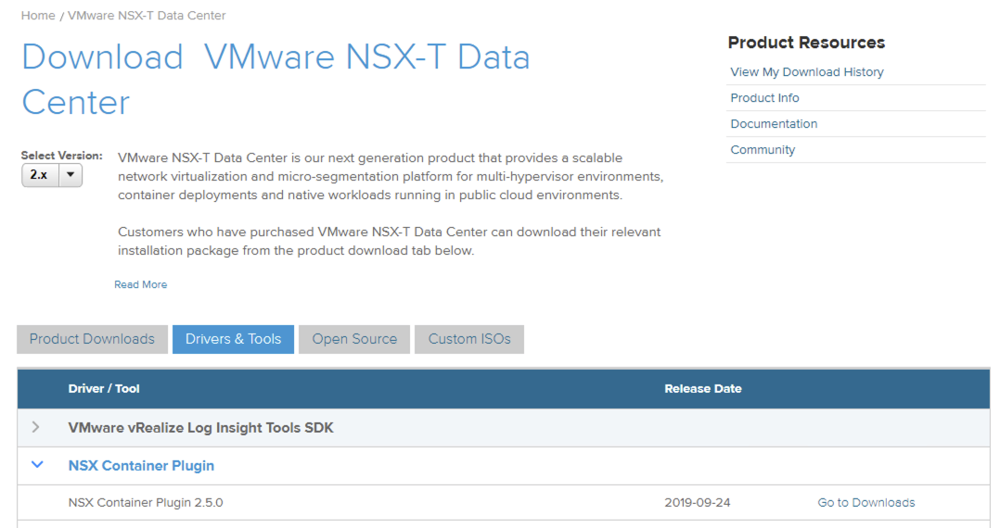
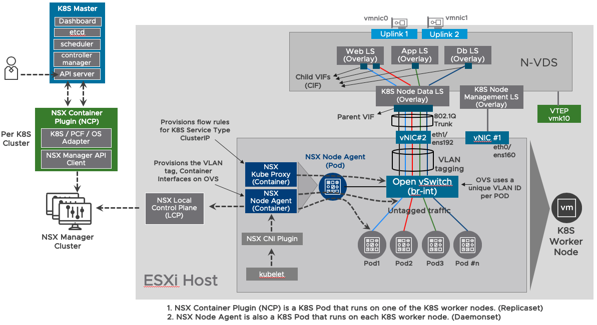

# NSX-T & K8S - PART 2
[Home Page](https://github.com/dumlutimuralp/nsx-t-k8s)

# Table Of Contents

[Container Network Interface (CNI)](#Container-Network-Interface)  
[NSX-T Components in Kubernetes Integration](#NSX-T-Components-in-Kubernetes-Integration)  
[Architecture](#Architecture)

# Container Network Interface
[Back to Table of Contents](#Table-Of-Contents)

* Container Network Interface (CNI) is a Cloud Native Computing Foundation (CNCF) project. It is a set of specifications and libraries to configure network interfaces for Linux containers. It has a pluggable architecture; hence third party plugins are supported. More info on CNI can be found [here](https://github.com/containernetworking/cni)   
Various solutions that have CNI plugin is listed [here](https://landscape.cncf.io/category=cloud-native-network&format=card-mode&grouping=category) by CNCF. A copy of the actual list is shown below (as of June 2019)

* Kubernetes uses CNI to support third party container networking solutions. More info can be found [here](https://kubernetes.io/docs/concepts/extend-kubernetes/compute-storage-net/network-plugins/#network-plugin-requirements) 

* VMware NSX-T CNI plugin comes within the "NSX-T Container" package as part of the downladable bits of NSX-T software from my.vmware.com. (shown below)

* NSX Container Plug-in for Kubernetes and Cloud Foundry - Installation and Administration Guide, published [here](https://docs.vmware.com/en/VMware-NSX-T-Data-Center/index.html), guides the user on the installation steps and the definition of the different components used for the NSX-T and K8S integration. Below is our own view and comments. 

# NSX-T Components in Kubernetes Integration
[Back to Table of Contents](#Table-Of-Contents)

This section explains the components that are implemented by NSX-T platform to enable Kubernetes integration. 

## Open vSwitch (OVS)

Instead of Linux bridge, NSX-T implements and uses Open vSwitch (OVS) on K8S nodes. It provides two main functions : 
- container networking for K8S Pods
- east west load balancing (aka K8S Service Type : Cluster IP)

##  The NSX Container Plugin (NCP) 

Per [NSX-T Documentation](https://docs.vmware.com/en/VMware-NSX-T-Data-Center/2.5/ncp-kubernetes/GUID-52A92986-0FDF-43A5-A7BB-C037889F7559.html) NCP is explained as following : NSX Container Plug-in (NCP) provides integration between NSX-T Data Center and container orchestrators such as Kubernetes, as well as integration between NSX-T Data Center and container-based PaaS (platform as a service) products such as OpenShift and Pivotal Cloud Foundry.

NCP is a container image that runs as an infrastructure K8S Pod on one of the worker nodes in the Kubernetes cluster. It is the management plane component that sits between the Kubernetes API Server (a Pod in K8s Master) and the NSX-T API (which is a service on NSX-T Manager). 

NCP creates a watch on Kubernetes API for any changes in "etcd" (K8S key/value cluster store). More info on "watch" can be found [here](https://kubernetes.io/docs/reference/using-api/api-concepts/#efficient-detection-of-changes).

As soon as any changes occur on an existing resource or a new resource gets created in etcd (i.e. namespace, pod, network policy, service) then Kubernetes API notifies NCP and then NCP sends out API calls towards NSX-T Manager API to realize the required logical networking constructs in the NSX-T platform (i.e. creating container interface (CIF) as a logical port on a logical switch, creating a logical switch, router, load balancer, NAT and distributed firewall rules etc.) 

For instance, 

- when a new namespace object is created in K8S, NCP captures this and creates a logical switch, a Tier 1 Logical Router and allocates an IP Pool for the Pods on NSX-T. It also allocates an SNAT IP for each NATed namespace and provisions the corresponding NAT rule on Tier 0 Logical Router)
- when Pods are created in a namespace on K8S, NCP captures this and allocates IP/MACs for each Pod on NSX-T

**Single instace of NCP POD supports a single Kubernetes cluster. The same NSX-T platform can be used by multiple Kubernetes clusters, each with its distinct NCP instance**.

**NCP is deployed as a "ReplicaSet" as part of K8S "deployment"**. As mentioned above it always runs on one of the worker nodes.  Basically a ReplicaSet makes sure that a specified number of copies of that Pod are running at any given time. Hence as any "ReplicaSet" in K8S, its availability is guaranteed by K8S. More info on ReplicaSet can be found [here](https://kubernetes.io/docs/concepts/workloads/controllers/replicaset/).

One other important thing to be aware of is, when NCP creates an object in NSX-T, it will put tags on it in NSX-T object datastore. Hence, even when NCP Pod fails and restarts, it can figure out which objects have already been created in NSX-T by itself.

NCP container Image and the deployment yaml file (ncp-deployment.yaml) comes within the .zip file content as part of the NSX Container Plugin download from my.VMware portal.
 
## NSX Node Agent 

NSX Node Agent is also a container image that runs as an infrastructure Pod on all of the worker nodes in the Kubernetes cluster. **It is deployed as a K8S "DaemonSet"**.  A DaemonSet ensures that all or specific nodes run a copy of a Pod. When a node is added to the cluster, that node will have the respective Pod added to itself. More info on DaemonSet can be found [here](https://kubernetes.io/docs/concepts/workloads/controllers/daemonset/)

NSX Node Agent Pod has three containers:   

NSX Kube Proxy, NSX Node Agent and OVS , all explained below.   
      
In K8S, the native Kube Proxy component provides distributed east-west load balancer (aka K8S Service Type : Cluster IP) based on IPTables (or IPVS lately). NSX Kube Proxy, on the other hand, leverages Open vSwitch (OVS) conntrack NAT feature, to provision flow rules on OVS to provide east-west distributed load-balancing. NSX Kube Proxy creates a watch on Kubernetes API for new K8S services which use the type Cluster IP. As soon as a new K8S service gets created with Cluster IP then NSX Kube Proxy provisions respective NAT translation rules and the server groups on OVS.  

NSX-T leverages Open vSwitch (OVS) on the K8S nodes. NSX Node Agent manages the OVS uplink and downlink configuration specifics; connecting the Kubernetes Pods to the OVS. It communicates with both NSX CNI Plugin and NSX Control Plane to achieve this. When a Pod is spun up on a K8S Node, NSX Node Agent is responsible for creating an OVS port and wiring that Pod to it and also tag the Pod' s traffic with the correct VLAN ID on the OVS uplink port (The use case of VLAN ID will be explained later on) 

The OVS container works as control plane only

## NSX CNI Plugin

* NSX CNI Plugin module is implemented on each Kubernetes node. (Which is done in Part 3 of this series) 
* The native K8S component called "kubelet", which is the K8S agent that runs on each K8s node, takes the set of PodSpecs (ie developer deploys an application with yaml file) that are provided through Kubernetes API. It then sends a request to NSX CNI Plugin to make the network available for the respective Pod(s). More info on kubelet can be found [here](https://kubernetes.io/docs/reference/command-line-tools-reference/kubelet/). 

# Architecture
[Back to Table of Contents](#Table-Of-Contents)

Below diagram shows how the architecture looks like. It is a collection of multiple individual diagrams that were shown in public sessions at VMworld 2017 and 2018 on NSX-T and Kubernetes integration. 

The components shown in this diagram like NSX Node Agent Pod, NSX Container Plugin (NCP) Pod , (the K8S deployment files (.yml) for both these Pods), OVS package and NSX CNI Plugin package are all downloadable in a single .zip file from my.VMware portal.

As shown in the diagram NSX-T dataplane is still implemented at the hypervisor level (rathen than extending the dataplane and overlay networking constructs all the way down to the K8S node VM level)

VLANs are used and locally significant only between the K8S worker node vNIC and the NVDS logical switch. The reason for VLAN usage is to be able to isolate each and every K8S Pod from each other secure the communication. This way NSX distributed firewalling can be implemented for each Pod and also each Pod can be connected to a different network (NSX-T Logical Switch/Segment)

**Note** : By default K8S does not deploy workload Pods on the Master node. Hence technically NSX components are not needed on the master node but only on the worker nodes when defaults are used. In our environment, even though workload Pod are not going to be deploted on K8S master, NSX Components are installed on all K8S nodes including the master. (For reference, scheduling Pods on the master node can be configured , more info [here](https://kubernetes.io/docs/concepts/configuration/taint-and-toleration/))

## [Part 3](https://github.com/dumlutimuralp/nsx-t-k8s/blob/master/Part%203/README.md)

