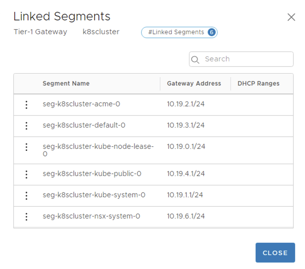
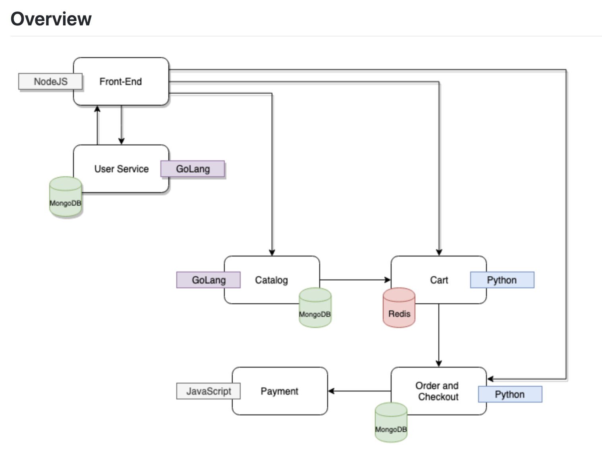
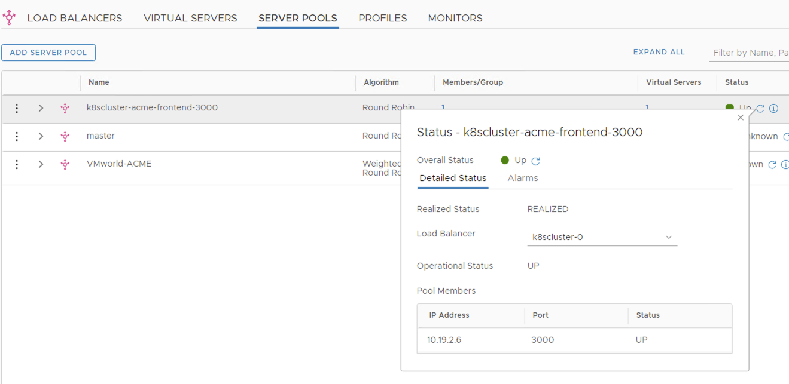
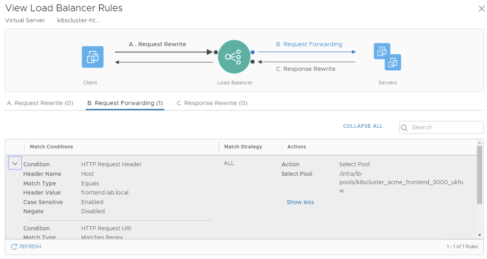

# NSX-T & K8S - PART 4
[Home Page](https://github.com/roie9876/NSXT-VMworld2019)

# Table Of Contents

[Current State](#Current-State)   
[NSX Container Plugin (NCP) Installation](#NSX-Container-Plugin-Installation)  
[Deploy sample Application](#Test-Workload-Deployment)

# Current State before install and configure the NCP
[Back to Table of Contents](#Table-Of-Contents)

## K8S Cluster

Previously in Part 3, K8S cluster has successfully been formed using kubeadm. 

<pre><code>
root@master:/home/localadmin# kubectl get node
NAME     STATUS   ROLES    AGE     VERSION
master   Ready    master   2d22h   v1.15.5
node01   Ready          <none>   2d22h   v1.15.5
node02   Ready          <none>   2d18h   v1.15.5

</code></pre>

The namespaces that are provisioned by default can be seen using the following kubectl command.

<pre><code>
root@master:/home/localadmin# kubectl get ns
NAME              STATUS   AGE
default           Active   2d22h
kube-node-lease   Active   2d22h
kube-public       Active   2d22h
kube-system       Active   2d22h
root@master:/home/localadmin#

</code></pre>

To see which infrastructure Pods are automatically provisioned during the initialization of K8S cluster, following command can be used.

<pre><code>
root@master:/home/localadmin# kubectl get pods --all-namespaces
NAMESPACE     NAME                             READY   STATUS              RESTARTS   AGE
kube-system   coredns-584795fc57-hwxrv         0/1     ContainerCreating   0          31s
kube-system   coredns-584795fc57-zpjh6         0/1     ContainerCreating   0          6s
kube-system   etcd-master                      1/1     Running             0          2d22h
kube-system   kube-apiserver-master            1/1     Running             0          2d22h
kube-system   kube-controller-manager-master   1/1     Running             0          2d22h
kube-system   kube-proxy-9bvvf                 1/1     Running             1          2d18h
kube-system   kube-proxy-9vhcf                 1/1     Running             1          2d22h
kube-system   kube-proxy-xpkhk                 1/1     Running             0          2d22h
kube-system   kube-scheduler-master            1/1     Running             0          2d22h

</code></pre>

_**Notice "coredns-xxx" Pods are stuck in "ContainerCreating" phase, the reason is although kubelet agent on K8S worker Node sent a request to NSX-T CNI Plugin module to start provisioning the individual network interface for these Pods, since the NSX Node Agent is not installed on the K8S worker nodes yet (Nor the NSX Container Plugin for attaching NSX-T management plane to K8S API) , kubelet can not move forward with the Pod creation.**_

We can learn it from the description of the coredns pod:  

<pre><code>
root@master:/home/localadmin# kubectl describe pod coredns-584795fc57-hwxrv  -n kube-system
Name:               coredns-584795fc57-hwxrv
Namespace:          kube-system
Priority:           2000000000
PriorityClassName:  system-cluster-critical
Node:               node02/192.168.110.73
Start Time:         Fri, 25 Oct 2019 11:22:00 +0300
Labels:             k8s-app=kube-dns
                    pod-template-hash=584795fc57
Annotations:        <none>
Status:             Pending
IP:
Controlled By:      ReplicaSet/coredns-584795fc57
Containers:
  coredns:
    Container ID:
    Image:         k8s.gcr.io/coredns:1.3.1
    Image ID:
    Ports:         53/UDP, 53/TCP, 9153/TCP
    Host Ports:    0/UDP, 0/TCP, 0/TCP
    Args:
      -conf
      /etc/coredns/Corefile
    State:          Waiting
      Reason:       ContainerCreating
    Ready:          False
    Restart Count:  0
    Limits:
      memory:  170Mi
    Requests:
      cpu:        100m
      memory:     70Mi
    Liveness:     http-get http://:8080/health delay=60s timeout=5s period=10s #success=1 #failure=5
    Readiness:    http-get http://:8080/health delay=0s timeout=1s period=10s #success=1 #failure=3
    Environment:  <none>
    Mounts:
      /etc/coredns from config-volume (ro)
      /var/run/secrets/kubernetes.io/serviceaccount from coredns-token-8xg74 (ro)
Conditions:
  Type              Status
  Initialized       True
  Ready             False
  ContainersReady   False
  PodScheduled      True
Volumes:
  config-volume:
    Type:      ConfigMap (a volume populated by a ConfigMap)
    Name:      coredns
    Optional:  false
  coredns-token-8xg74:
    Type:        Secret (a volume populated by a Secret)
    SecretName:  coredns-token-8xg74
    Optional:    false
QoS Class:       Burstable
Node-Selectors:  beta.kubernetes.io/os=linux
Tolerations:     CriticalAddonsOnly
                 node-role.kubernetes.io/master:NoSchedule
                 node.kubernetes.io/not-ready:NoExecute for 300s
                 node.kubernetes.io/unreachable:NoExecute for 300s
Events:
  Type     Reason                  Age               From               Message
  ----     ------                  ----              ----               -------
  Normal   Scheduled               45s               default-scheduler  Successfully assigned kube-system/coredns-584795fc57-hwxrv to node02
  Warning  FailedCreatePodSandBox  44s               kubelet, node02    Failed create pod sandbox: rpc error: code = Unknown desc = [failed to set up sandbox container "8958bc4b62fa3292d8209e423b34d49d78fa9749b153db733b7ffcd30bae3ac2" network for pod "coredns-584795fc57-hwxrv": NetworkPlugin cni failed to set up pod "coredns-584795fc57-hwxrv_kube-system" network: Failed to connect to nsx_node_agent: [Errno 111] Connection refused, failed to clean up sandbox container "8958bc4b62fa3292d8209e423b34d49d78fa9749b153db733b7ffcd30bae3ac2" network for pod "coredns-584795fc57-hwxrv": NetworkPlugin cni failed to teardown pod "coredns-584795fc57-hwxrv_kube-system" network: Failed to connect to nsx_node_agent: [Errno 111] Connection refused]
  Normal   SandboxChanged          2s (x4 over 44s)  kubelet, node02    Pod sandbox changed, it will be killed and re-created.
</code></pre>

# NSX Container Plugin Installation
[Back to Table of Contents](#Table-Of-Contents)

Once again, NSX Container Plugin (NCP) image file is in the NSX container folder that was copied to each K8S node will be used in this section. 

## Load The Docker Image for NSX NCP (and NSX Node Agent) on K8S Nodes

For the commands below, "sudo" can be used with each command or privilege can be escalated to root by using "sudo -H bash" in advance.

On each K8S node, navigate to "/home/vmware/nsx-container-2.4.1.13515827/Kubernetes" folder then execute the following command to load respective image to the local Docker repository of each K8S Node. 

_**NSX Container Plugin (NCP) and NSX Node Agent Pods use the same container image.**_

## Install NCP image on all masters and Workers 

CNI is a Cloud Native Computing Foundation (CNCF) project. It is a set of specifications and libraries to configure network interfaces in Linux containers. It has a pluggable architecture hence third party plugins are supported.

NSX-T CNI Plugin comes within the "NSX-T Container" package. The package can be downloaded (in _.zip_ format) from Downloads page for NSX-T, shown below.

In the current NSX-T version (2.5.0) , the zip file is named as "**nsx-container-2.5.0.14628220**" . 

* Extract the zip file to a folder. 

* Use SCP/SSH to copy the folder to the Ubuntu node. Winscp is used as the SCP tool on Windows client and the folder is copied to /home/vmware location on Ubuntu node.

* **For all the installation steps mentioned below and following sections in this guide root level access will be used.**

* Escalate to root in the shell

<pre><code>
vmware@k8s-master:~$ <b>sudo -H bash</b>
[sudo] password for vmware:
root@k8s-master:/home/vmware#
</code></pre>

* On the Ubuntu shell, navigate to "/home/vmware/nsx-container-2.5.0.14628220/Kubernetes/" folder, and then install NCP image shown below.

<pre><code>
root@k8s-master:/home/vmware/nsx-container-2.5.0.14628220/Kubernetes/# 
<b>docker load  -i nsx-ncp-ubuntu-2.5.0.14628220.tar</b>
Loaded image: registry.local/2.5.0.14628220/nsx-ncp-ubuntu:latest
</code></pre>

then we need to tag the ncp image as nsx-ncp:
<pre><code>
docker tag registry.local/2.5.0.14628220/nsx-ncp-ubuntu:latest nsx-ncp
</code></pre>

<pre><code>
root@k8s-master:/home/vmware/nsx-container-2.5.0.14628220/Kubernetes# <b> docker tag registry.local/2.5.0.14628220/nsx-ncp-ubuntu:latest nsx-ncp:latest</b>
root@k8s-master:/home/vmware/nsx-container-2.5.0.14628220/Kubernetes#
</code></pre>

Verify the image name has changed. 

<pre><code>
root@master:/home/localadmin# docker images
REPOSITORY                                                         TAG                 IMAGE ID            CREATED             SIZE
k8s.gcr.io/kube-apiserver                                          v1.14.8             1e94481e8f30        9 days ago          209MB
k8s.gcr.io/kube-proxy                                              v1.14.8             849af609e0c6        9 days ago          82.1MB
k8s.gcr.io/kube-controller-manager                                 v1.14.8             36a8001a79fd        9 days ago          158MB
k8s.gcr.io/kube-scheduler                                          v1.14.8             f1e3e5f9f93e        9 days ago          81.6MB
registry.local/2.5.0.14628220/nsx-ncp-ubuntu                       latest              40aae9a4aeda        6 weeks ago         744MB
nsx-ncp                                                            latest              40aae9a4aeda        6 weeks ago         744MB
284299419820.dkr.ecr.us-west-2.amazonaws.com/ws-client             v1.0.0              d87c306ddd38        6 weeks ago         79.9MB
284299419820.dkr.ecr.us-west-2.amazonaws.com/k8s-cluster-manager   v0.7.3              c9225cfd6d91        6 weeks ago         148MB
k8s.gcr.io/coredns                                                 1.3.1               eb516548c180        9 months ago        40.3MB
k8s.gcr.io/etcd                                                    3.3.10              2c4adeb21b4f        10 months ago       258MB
tiswanso/install-cni                                               v0.1-dev            84a707a64677        11 months ago       42.8MB
k8s.gcr.io/pause                                                   3.1                 da86e6ba6ca1        22 months ago       742kB

</code></pre>

## Confiure the NCP for K8s Cluster 

In NCP version 2.5 the process of installation and configuration of the NCP improved a lot by automating it.
The only thing that we need to do is configure one yaml file name ncp-ubuntu.yaml. we can find this file in the folder of the NCP installation. 

example of thee original file (before we modiey it) can be found in this link:
[here](https://github.com/roie9876/NSXT-VMworld2019/blob/master/Part%204/ncp-ubuntu.yaml)

We now start to explain the diffrent filed of this file

##  (NCP) Configuration 

The file, "ncp-ubuntu.yml" will be used to deploy NSX Container Plugin. Node-Agent, Kube-Proxy , OVS and other related NCP configurations. 
However, before moving forward, NSX-T specific environmental parameters need to be configured. The yml file contains a configmap for the configuration of the ncp.ini file for the NCP.  Basically most of the parameters are commented out with a "#" character. The definitions of each parameter are in the yml file itself. 

The "ncp-ubuntu.yml" file can simply be edited with a text editor. The parameters in the file that are used in this environment has "#" removed. Below is a list and explanation of each :

staring with NCP 2.5 we can work with the policy API. with Policy API we need to defined the UUIDs of the objects.
#### Note: The UUIDs of the policy API are differences then the UUIDs of the manager API.

### how we can find the Policy UUID ? 
With the Chrome browser, we need to use the  Developer Tools:  
 

Click on the Ctrl + R to start record:  

  

We can clear the screen by the small icon   
for example lets find the UUID of the K8s-LB-Pool: 
We need to click on the NSX-T object that we would like to find his UUID:  

There is a small blue circle refresh button:   , Click on it. New date will show up. as you can see in the image bellow  
the **"id" : "k8s-LB-Poo"** this is the object UUID.  
  
    
    

let's start to explain the different parameters:  
[nsx_v3] 

**policy_nsxapi = True** : Specify that NCP will work with the Policy API.  

**single_tier_topology = True** : configure single tier1 per K8s/OpenShift Cluster. starting with NCP 2.5 we have two options for the tier1. we can manually create this tier1 and specify his name in the ncp config file, or we can let ncp automatically create this tier1. in this demo we want NCP to create this tier1 gateway. the name of tier1 taken from the **cluster =** parameters, in our demo its k8scluster.

**cluster = k8scluster** : Used to identify the NSX-T objects that are provisioned for this K8S cluster. Notice that K8S Node logical ports in "K8s-Contaainers" are configured with the "k8scluster" tag and the "ncp/cluster" scope also with the hostname of Ubuntu node as the tag and "ncp/node_name" scope on NSX-T side.

**enable_snat = True** : This parameter basically defines that all the K8S Pods in each K8S namespace in this K8S cluster will be SNATed (to be able to access the other resources in the datacenter external to NSX domain) . The SNAT rules will be autoatically provisioned on Tier 0 Router in this lab. The SNAT IP will be allocated from IP Pool named "K8S-NAT-Pool" that was configured back in Part 3.

**apiserver_host_port = 6443** : These parameters are for NCP to access K8S API. **Note this parnter need to configured multiple times in this yaml file, so every time you this parmter you need to configure the same value**
  
**apiserver_host_ip = 192.168.113.2**  
This is the IP address of the master node, if we have clusters of k8s masters we need to use the LB VIP.  
**Note this paramter need to configured multiple times in this yaml file, so every time you this parmter you need to configure the same value**

**ingress_mode = nat** : This parameter basically defines that NSX will use SNAT/DNAT rules for K8S ingress (L7 HTTPS/HTTP load balancing) to access the K8S service at the backend.

**nsx_api_managers = 192.168.110.34,192.168.110.35,192.168.110.36** , **nsx_api_user = admin** ,  **nsx_api_password = VMware1!VMware1!**  : These parameters are for NCP to access/consume the NSX Manager. in my lab i have 3 NSX managers, we need to provide the IPs of all managers (not the VIP of the managers). we can work with static username and passowrd (clear text) or we can work with certificate. in this demo i'm working with username and password.

**insecure = True** : NSX Manager server certificate is not verified. in lab enviroment where the NSX manager is self sigeded its better to use this way.

**ttier0_gateway = tier0** : The UUID of the Logical Gateway that will be used for connection top the phisical router (tier0).

**overlay_tz = a8811e7a-4d09-4076-94b3-7a9082750c64** : The UUID of the existing overlay transport zone that will be used for creating new logical switches/segments for K8S namespaces and container networking.

**subnet_prefix = 24** : The size of the IP Pools for the namespaces that will be carved out from the main "K8S-POD-IP-BLOCK" configured in Part 3 (10.19.0.0 /16). Whenever a new K8S namespace is created a /24 IP pool will be allocated from thatthat IP block.

**use_native_loadbalancer = True** : This setting is to use NSX-T load balancer for K8S Service Type : Load Balancer. Whenever a new K8S service is exposed with the Type : Load Balancer then a VIP will be provisioned on NSX-T LB attached to a Tier 1 Logical Router dedicated for LB function. The VIP will be allocated from the IP Pool named "K8S-LB-Pool" that was configured back in Part 3.

**default_ingress_class_nsx = True** : This is to use NSX-T load balancer for K8S ingress (L7 HTTP/HTTPS load balancing) , instead of other solutions such as NGINX, HAProxy etc. Whenever a K8S ingress object is created, a Layer 7 rule will be configured on the NSX-T load balancer.

**service_size = 'SMALL'** : This setting configures a small sized NSX-T Load Balancer for the K8S cluster. Options are Small/Medium/Large. This is the Load Balancer instance which is attached to a dedicated Tier 1 Logical Router in the topology.

**container_ip_blocks = K8S-POD-IP-BLOCK** : This setting defines from which IP block each K8S namespace will carve its IP Pool/IP address space from. (172.25.0.0 /16 in this case) Size of each K8S namespace pool was defined with subnet_prefix parameter above)

**external_ip_pools = K8S-NAT-Pool** : This setting defines from which IP pool each SNAT IP will be allocated from. Whenever a new K8S namespace is created, then a NAT IP will be allocated from this pool. (10.190.7.100 to 10.190.7.150 in this case)

**external_ip_pools_lb = K8S-LB-Pool** : This setting defines from which IP pool each K8S service, which is configured with Type : Load Balancer, will allocate its IP from. (10.190.6.100 to 10.190.6.150 in this case)

**top_firewall_section_marker = Section1** and **bottom_firewall_section_marker = Section2** : This is to specify between which sections the K8S orchestrated firewall rules will fall in between. 

_**One additional configuration that is made in the yml file is removing the "#" from the line where it says "serviceAccountName: ncp-svc-account" . So that the NCP Pod has appropriate role and access to K8S cluster resources**_ 

here is the linke for the full ncp file i'm using for vmworld demo:
[here](https://github.com/roie9876/NSXT-VMworld2019/blob/master/Part%204/ncp-vmworld2019.yml)

The edited yml file, "ncp-vmworld2019.yml" in this case, can now be deployed from anywhere. In this environment this yml file is copied to /home/vmware folder in K8S Master Node and deployed   the following command.

<pre><code>
root@master:/home/localadmin# kubectl create  -f ncp-vmworld2019.yml
customresourcedefinition.apiextensions.k8s.io/nsxerrors.nsx.vmware.com created
customresourcedefinition.apiextensions.k8s.io/nsxlocks.nsx.vmware.com created
namespace/nsx-system created
serviceaccount/ncp-svc-account created
clusterrole.rbac.authorization.k8s.io/ncp-cluster-role created
clusterrole.rbac.authorization.k8s.io/ncp-patch-role created
clusterrolebinding.rbac.authorization.k8s.io/ncp-cluster-role-binding created
clusterrolebinding.rbac.authorization.k8s.io/ncp-patch-role-binding created
serviceaccount/nsx-node-agent-svc-account created
clusterrole.rbac.authorization.k8s.io/nsx-node-agent-cluster-role created
clusterrolebinding.rbac.authorization.k8s.io/nsx-node-agent-cluster-role-binding created
configmap/nsx-ncp-config created
deployment.extensions/nsx-ncp created
configmap/nsx-node-agent-config created
daemonset.extensions/nsx-ncp-bootstrap created
daemonset.extensions/nsx-node-agent created
</code></pre> 

Verify that the new namespace is created. 

<pre><code>
root@master:/home/localadmin# kubectl get ns
NAME              STATUS   AGE
default           Active   3d
kube-node-lease   Active   3d
kube-public       Active   3d
kube-system       Active   3d
nsx-system        Active   8s
</code></pre> 

<pre><code>
root@master:/home/localadmin# kubectl get pod -n nsx-system
NAME                       READY   STATUS     RESTARTS   AGE
nsx-ncp-848cc8c8ff-qzmb8   1/1     Running    0          14s
nsx-ncp-bootstrap-552hh    1/1     Running    0          14s
nsx-ncp-bootstrap-5t8jv    1/1     Running    0          14s
nsx-ncp-bootstrap-mncpl    0/1     Init:0/1   0          14s
nsx-node-agent-fr86l       3/3     Running    0          14s
nsx-node-agent-hwqm6       3/3     Running    0          14s
nsx-node-agent-x2ndb       3/3     Running    0          14s
</code></pre> 

After few min the boostrap pod install the: node-agent, kube-proxy , and OVS on all masters and workers.
then the nsx-system will be look like this:

<pre><code>
root@master:/home/localadmin# kubectl get pod -n nsx-system
NAME                       READY   STATUS    RESTARTS   AGE
nsx-ncp-848cc8c8ff-qzmb8   1/1     Running   0          25m
nsx-ncp-bootstrap-552hh    1/1     Running   0          25m
nsx-ncp-bootstrap-5t8jv    1/1     Running   0          25m
nsx-ncp-bootstrap-mncpl    1/1     Running   0          25m
nsx-node-agent-fr86l       3/3     Running   0          25m
nsx-node-agent-hwqm6       3/3     Running   0          25m
nsx-node-agent-x2ndb       3/3     Running   0          25m

</code></pre> 

We can take a look which containers run inside the nsx-node-agent:

<pre><code>
root@master:/home/localadmin# kubectl describe pod nsx-node-agent-x2ndb -n nsx-system
Name:               nsx-node-agent-x2ndb
Namespace:          nsx-system
Priority:           0
PriorityClassName:  <none>
Node:               master/192.168.110.70
Start Time:         Fri, 25 Oct 2019 12:59:40 +0300
Labels:             component=nsx-node-agent
                    controller-revision-hash=7cb5bc85d9
                    pod-template-generation=1
                    tier=nsx-networking
                    version=v1
Annotations:        container.apparmor.security.beta.kubernetes.io/nsx-node-agent: localhost/node-agent-apparmor
Status:             Running
IP:                 192.168.110.70
Controlled By:      DaemonSet/nsx-node-agent
Containers:
  nsx-node-agent:
    Container ID:  docker://9d583acd20699e4731aa2c0188f9cec085c782c632fcfe111370adfe20555c53
    Image:         nsx-ncp
    Image ID:      docker://sha256:40aae9a4aeda247a15d278a844a77cb0cd4361d63e4ce869d2969099ef27f264
    Port:          <none>
    Host Port:     <none>
    Command:
      start_node_agent
    State:          Running
      Started:      Fri, 25 Oct 2019 12:59:41 +0300
    Ready:          True
    Restart Count:  0
    Liveness:       exec [/bin/sh -c timeout 5 check_pod_liveness nsx-node-agent] delay=5s timeout=5s period=10s #success=1 #failure=5
    Environment:    <none>
    Mounts:
      /etc/nsx-ujo/ncp.ini from config-volume (ro,path="ncp.ini")
      /host/proc from proc (ro)
      /var/run/netns from netns (rw)
      /var/run/nsx-ujo from cni-sock (rw)
      /var/run/openvswitch from openvswitch (rw)
      /var/run/secrets/kubernetes.io/serviceaccount from nsx-node-agent-svc-account-token-46kbd (ro)
  nsx-kube-proxy:
    Container ID:  docker://292992ba9c613d85ff5020bcb24ecb11bb34c00808ca29436a6f6e3cefa9c456
    Image:         nsx-ncp
    Image ID:      docker://sha256:40aae9a4aeda247a15d278a844a77cb0cd4361d63e4ce869d2969099ef27f264
    Port:          <none>
    Host Port:     <none>
    Command:
      start_kube_proxy
    State:          Running
      Started:      Fri, 25 Oct 2019 12:59:42 +0300
    Ready:          True
    Restart Count:  0
    Liveness:       exec [/bin/sh -c timeout 5 check_pod_liveness nsx-kube-proxy] delay=5s timeout=1s period=5s #success=1 #failure=3
    Environment:    <none>
    Mounts:
      /etc/nsx-ujo/ncp.ini from config-volume (ro,path="ncp.ini")
      /var/run/openvswitch from openvswitch (rw)
      /var/run/secrets/kubernetes.io/serviceaccount from nsx-node-agent-svc-account-token-46kbd (ro)
  nsx-ovs:
    Container ID:  docker://29650d44a6622a5306d4f79a95728f3b0f624550eb920d30d3469b74378fd876
    Image:         nsx-ncp
    Image ID:      docker://sha256:40aae9a4aeda247a15d278a844a77cb0cd4361d63e4ce869d2969099ef27f264
    Port:          <none>
    Host Port:     <none>
    Command:
      start_ovs
    State:          Running
      Started:      Fri, 25 Oct 2019 12:59:43 +0300
    Ready:          True
    Restart Count:  0
    Liveness:       exec [/bin/sh -c timeout 5 check_pod_liveness nsx-ovs] delay=5s timeout=1s period=5s #success=1 #failure=3
    Environment:    <none>
    Mounts:
      /etc/nsx-ujo/ncp.ini from config-volume (ro,path="ncp.ini")
      /etc/openvswitch from host-config-openvswitch (rw)
      /host/etc/os-release from host-os-release (ro)
      /lib/modules from host-modules (ro)
      /sys from host-sys (ro)
      /var/run/openvswitch from openvswitch (rw)
      /var/run/secrets/kubernetes.io/serviceaccount from nsx-node-agent-svc-account-token-46kbd (ro)
Conditions:
  Type              Status
  Initialized       True
  Ready             True
  ContainersReady   True
  PodScheduled      True
Volumes:
  config-volume:
    Type:      ConfigMap (a volume populated by a ConfigMap)
    Name:      nsx-node-agent-config
    Optional:  false
  openvswitch:
    Type:          HostPath (bare host directory volume)
    Path:          /var/run/openvswitch
    HostPathType:
  cni-sock:
    Type:          HostPath (bare host directory volume)
    Path:          /var/run/nsx-ujo
    HostPathType:
  netns:
    Type:          HostPath (bare host directory volume)
    Path:          /var/run/netns
    HostPathType:
  proc:
    Type:          HostPath (bare host directory volume)
    Path:          /proc
    HostPathType:
  host-sys:
    Type:          HostPath (bare host directory volume)
    Path:          /sys
    HostPathType:
  host-modules:
    Type:          HostPath (bare host directory volume)
    Path:          /lib/modules
    HostPathType:
  host-config-openvswitch:
    Type:          HostPath (bare host directory volume)
    Path:          /etc/openvswitch
    HostPathType:
  host-os-release:
    Type:          HostPath (bare host directory volume)
    Path:          /etc/os-release
    HostPathType:
  nsx-node-agent-svc-account-token-46kbd:
    Type:        Secret (a volume populated by a Secret)
    SecretName:  nsx-node-agent-svc-account-token-46kbd
    Optional:    false
QoS Class:       BestEffort
Node-Selectors:  <none>
Tolerations:     node-role.kubernetes.io/master:NoSchedule
                 node.kubernetes.io/disk-pressure:NoSchedule
                 node.kubernetes.io/memory-pressure:NoSchedule
                 node.kubernetes.io/network-unavailable:NoSchedule
                 node.kubernetes.io/not-ready:NoSchedule
                 node.kubernetes.io/not-ready:NoExecute
                 node.kubernetes.io/pid-pressure:NoSchedule
                 node.kubernetes.io/unreachable:NoSchedule
                 node.kubernetes.io/unreachable:NoExecute
                 node.kubernetes.io/unschedulable:NoSchedule
Events:
  Type     Reason     Age                From               Message
  ----     ------     ----               ----               -------
  Normal   Scheduled  26m                default-scheduler  Successfully assigned nsx-system/nsx-node-agent-x2ndb to master
  Normal   Pulled     26m                kubelet, master    Container image "nsx-ncp" already present on machine
  Normal   Created    26m                kubelet, master    Created container nsx-node-agent
  Normal   Started    26m                kubelet, master    Started container nsx-node-agent
  Normal   Pulled     26m                kubelet, master    Container image "nsx-ncp" already present on machine
  Normal   Created    26m                kubelet, master    Created container nsx-kube-proxy
  Normal   Started    26m                kubelet, master    Started container nsx-kube-proxy
  Normal   Pulled     26m                kubelet, master    Container image "nsx-ncp" already present on machine
  Normal   Created    26m                kubelet, master    Created container nsx-ovs
  Normal   Started    26m                kubelet, master    Started container nsx-ovs
  Warning  Unhealthy  26m (x2 over 26m)  kubelet, master    Liveness probe failed:

</code></pre> 

We have the 3 following containers:  
*nsx-node-agent  
*nsx-kube-proxy  
*nsx-ovs

**Notice the changes to the existing logical switches/segments, Tier 1 Logical Routers, Load Balancer below . All these newly created objects have been provisioned by NCP (as soon as NCP Pod has been successfully deployed) by identifying the  the K8S desired state and mapping the K8S resources in etcd to the NSX-T Logical Networking constructs.**

LOGICAL Segments  

New Tier1 LOGICAL Gateway:

Connected to this Tier1 logical router we have the following Segnets: 

SNAT Rules

LOAD BALANCER runing on the same Tier1 created to the k8scluster

VIRTUAL SERVERS for INGRESS on LOAD BALANCER

FIREWALL RULEBASE

Notice also that CoreDNS pods are changed thier status to Running state.  
<pre><code>
root@master:/home/localadmin# kubectl get pod -n kube-system
NAME                             READY   STATUS    RESTARTS   AGE
coredns-584795fc57-5wvll         1/1     Running   1          3d20h
coredns-584795fc57-pmgl5         1/1     Running   1          3d20h
etcd-master                      1/1     Running   0          4d5h
kube-apiserver-master            1/1     Running   0          4d5h
kube-controller-manager-master   1/1     Running   0          4d5h
kube-proxy-vpgfq                 1/1     Running   0          4d5h
kube-proxy-zlc9f                 1/1     Running   0          4d5h
kube-scheduler-master            1/1     Running   0          4d5h
</code></pre> 

# Deploy the acme application
Thie application contains a Polyglot demo application comprised of (presently) 6 microservices and 4 datastores:  

The contents here are the necessary YAML files to deploy the ACMEFIT application in a kubernetes cluster.

This app is developed by team behind www.cloudjourney.io

https://github.com/roie9876/acme_fitness_demo

<pre><code>
git clone https://github.com/roie9876/acme_fitness_demo
</code></pre> 

create acme  namespace, we can work with NAT namespace or No-NAT. lets create No-Nat. to do this we need to anotated the namespace.

<pre><code>
cat acme-no-nat.yaml
apiVersion: v1
kind: Namespace
metadata:
   name: acme
   annotations:
      ncp/no_snat: "True"
</code></pre> 

<pre><code>
root > cat acme-no-nat.yaml
apiVersion: v1
kind: Namespace
metadata:
   name: acme
   annotations:
      ncp/no_snat: "True"
root > kubectl create -f acme-no-nat.yaml
namespace/acme created  
  

root > kubectl describe ns acme
Name:         acme
Labels:       <none>
Annotations:  ncp/no_snat: True
Status:       Active

No resource quota.

No resource limits.

</code></pre>   

We can see the results of the new namespace in NSX Segments, we have new Segment with the name: seg-k8cluster-acme-0.  
In the PORTS we have 0 Connected PODs (we didn't deploy any PODs yet...)

NSXT curve new CIDR 10.19.2.0/24 where the 10.19.2.1 is the default Gateway for this namespce 

We can chekc if we have NCP create NAT rule for this namespace:  
As you can see there is no any ANT entry for 10.19.2.0/42

Lets change the default namespace to acme:
<pre><code>
root > kubectl config set-context --current --namespace=acme
Context "kubernetes-admin@kubernetes" modified.
 </code></pre>   

# Deploy the acme application:  
<pre><code>
root > kubectl create -f acme_fitness.yaml
secret/redis-pass created
secret/catalog-mongo-pass created
secret/order-mongo-pass created
secret/users-mongo-pass created
service/cart-redis created
deployment.apps/cart-redis created
service/cart created
deployment.apps/cart created
configmap/catalog-initdb-config created
service/catalog-mongo created
deployment.apps/catalog-mongo created
service/catalog created
deployment.apps/catalog created
deployment.apps/frontend created
service/order-mongo created
deployment.apps/order-mongo created
service/order created
deployment.apps/order created
service/payment created
deployment.apps/payment created
configmap/users-initdb-config created
service/users-mongo created
deployment.apps/users-mongo created
service/users created
deployment.apps/users created
 </code></pre>    

<pre><code>
root > kubectl get pod -o wide
NAME                             READY   STATUS    RESTARTS   AGE   IP           NODE     NOMINATED NODE   READINESS GATES
cart-6d84f4cf64-ftlbp            1/1     Running   0          42s   10.19.2.4    node02   <none>           <none>
cart-redis-7fcdbcd8d8-848rx      1/1     Running   0          42s   10.19.2.5    node02   <none>           <none>
catalog-587f7df8c8-7bxst         1/1     Running   0          41s   10.19.2.2    node02   <none>           <none>
catalog-mongo-5c8db99954-l2plp   1/1     Running   0          41s   10.19.2.3    node02   <none>           <none>
frontend-7557468545-9gzb2        1/1     Running   0          41s   10.19.2.6    node02   <none>           <none>
order-c8885777b-kjdf7            1/1     Running   0          41s   10.19.2.8    node02   <none>           <none>
order-mongo-7cc8f784f8-tl29b     1/1     Running   0          41s   10.19.2.7    node02   <none>           <none>
payment-79bc456ff-cxprm          1/1     Running   0          40s   10.19.2.9    node02   <none>           <none>
users-6d7c5dd7c8-t6jmc           1/1     Running   0          40s   10.19.2.11   node02   <none>           <none>
users-mongo-7cfb97b5bb-mxhkc     1/1     Running   0          40s   10.19.2.10   node02   <none>           <none>
  
</code></pre>   
As you can see, all the PODs get IPs from range 10.19.2.0/24

We can see the reflections of the PODs in NSXT
  

Now we have 10 PORTs connected to this segments
we can see the PODs name from NSX UI:  

We can see all the K8s tags from the NSX UI:  

The Load Balancer status before deploy new LB VIPs:

This is the default VIP created with the K8s cluster.

# L4 Load Balancer
Create new L4 Service Type LB with persistence IP
<pre><code>
root > cat frontend-svc.yaml
apiVersion: v1
kind: Service
metadata:
  labels:
    app: frontend-total
    service: frontend
  name: frontend
  namespace: acme
spec:
  ports:
  - name: http-frontend
    nodePort: 30807
    port: 3000
    protocol: TCP
    targetPort: 3000
  selector:
    app: frontend-total
    service: frontend
  type: LoadBalancer
  loadBalancerIP: 10.15.100.100
</code></pre>  

We expting the VIP IP address will be 10.15.100.100
<pre><code>
root > kubectl create -f frontend-svc.yaml
service/frontend created
root > kubectl get svc
NAME            TYPE           CLUSTER-IP       EXTERNAL-IP     PORT(S)          AGE
cart            ClusterIP      10.100.119.49    <none>          5000/TCP         22m
cart-redis      ClusterIP      10.105.208.2     <none>          6379/TCP         22m
catalog         ClusterIP      10.101.251.48    <none>          8082/TCP         22m
catalog-mongo   ClusterIP      10.111.14.3      <none>          27017/TCP        22m
frontend        LoadBalancer   10.105.235.195   10.15.100.100   3000:30807/TCP   9s
order           ClusterIP      10.111.73.197    <none>          6000/TCP         22m
order-mongo     ClusterIP      10.97.151.38     <none>          27017/TCP        22m
payment         ClusterIP      10.103.128.200   <none>          9000/TCP         22m
users           ClusterIP      10.106.44.10     <none>          8081/TCP         22m
users-mongo     ClusterIP      10.104.246.186   <none>          27017/TCP        22m

</code></pre>   

The as you can see the svc of the frontend has 10.15.100.100 with port 3000 as L4 entry.
We can see the results of the new LB VIP in NSX UI:

We can see the server pool member from NSX UI:

Scale more frontend PODs to the acme app:

<pre><code>
root > kubectl scale --replicas=2 deployment frontend
deployment.extensions/frontend scaled
  
</code></pre>   

We can see that we now have 2 endpoint in the service pool: 
<pre><code>  
root > kubectl describe svc frontend
Name:                     frontend
Namespace:                acme
Labels:                   app=frontend-total
                          service=frontend
Annotations:              ncp/internal_ip_for_policy: 100.64.128.5
Selector:                 app=frontend-total,service=frontend
Type:                     LoadBalancer
IP:                       10.105.235.195
IP:                       10.15.100.100
LoadBalancer Ingress:     10.15.100.100
Port:                     http-frontend  3000/TCP
TargetPort:               3000/TCP
NodePort:                 http-frontend  30807/TCP
Endpoints:                10.19.2.12:3000,10.19.2.6:3000
Session Affinity:         None
External Traffic Policy:  Cluster
Events:                   <none>
 
</code></pre> 

From NSX UI we can see we have new member in the server pool:

Test the acme application with the broswer:

# L7 Ingress
We can create L7 ingress for the frontend service:  

root > cat ingress.yaml
apiVersion: extensions/v1beta1
kind: Ingress
metadata:
  name: frontend
spec:
  rules:
  - host: frontend.lab.local
    http:
      paths:
      - path: /*
        backend:
          serviceName: frontend
          servicePort: 3000
root > kubectl create -f ingress.yaml
ingress.extensions/frontend created
root > kubectl describe ingress frontend
Name:             frontend
Namespace:        acme
Address:          10.20.1.1
Default backend:  default-http-backend:80 (<none>)
Rules:
  Host                Path  Backends
  ----                ----  --------
  frontend.lab.local
                      /*   frontend:3000 (10.19.2.12:3000,10.19.2.6:3000)
Annotations:
  ncp/internal_ip_for_policy:  100.64.128.5
Events:                        <none>

In the NSX-T LB we can can see the L7 rule:  
The rule created in the **Request Forwarding Phase**

We can view the re-write rule from the UI:  

The user sends traffic to URL: frontend.lab.local which hit the L7 Ingress in NSX LB. Then the NSX LB re-write this request and sends it to the K8s frontend pool.

